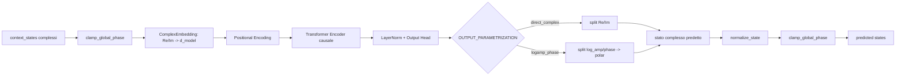
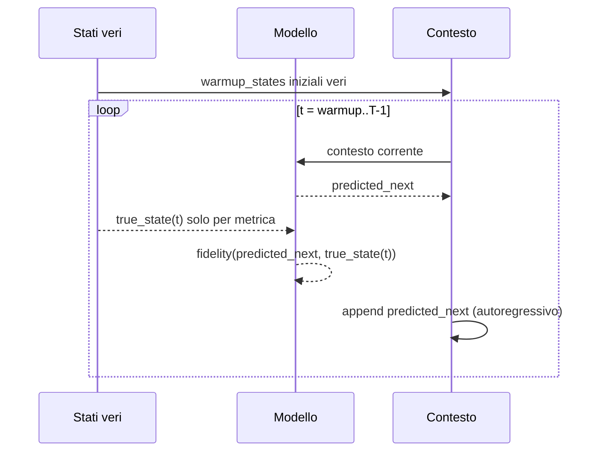

# Architettura Completa del Software (dal `main.py`)

Questo documento descrive **tutta la pipeline** del progetto `quantum_sequence_prediction`, partendo da `main.py` e seguendo il percorso completo:

`input (con logica) -> trasformazioni interne -> output`

L'obiettivo e' rendere esplicito, senza salti, sia il livello:
- **tecnico/software** (moduli, tensori, funzioni, training, evaluation, artifact),
- **fisico** (stati quantistici, Hamiltoniana TFIM, evoluzione unitaria, osservabili, fidelity).

---

## 1) Vista Globale End-to-End

Pipeline reale eseguita da `main.py`:

1. **Bootstrap runtime**
   - imposta limiti thread CPU (`OMP_NUM_THREADS=1`, `MKL_NUM_THREADS=1`, `torch.set_num_threads(1)`),
   - seleziona backend plotting non interattivo (`matplotlib.use("Agg")`),
   - carica configurazione da `config.py` (con eventuali override da variabili ambiente).

2. **Inizializzazione run**
   - seed globale (`set_seed`),
   - creazione cartella risultati (`results_paper_logamp_phase`).

3. **Generazione dataset fisico** (`generate_fixed_tfim_dataset`)
   - costruisce una singola Hamiltoniana TFIM (train + test condividono questa H),
   - campiona stati iniziali,
   - evolve ogni stato in traiettoria con operatore unitario `U = exp(i H dt)`,
   - produce `train.states` e `test.states`.

4. **Build modello** (`build_model`)
   - istanzia `QuantumSequencePredictor` (Transformer causale su stati complessi).

5. **(Opzionale) Resume checkpoint** (`_try_resume_from_last_checkpoint`)
   - se abilitato, ripristina stato modello/optimizer/scheduler/storia.

6. **Training** (`train_model`)
   - loss principale: `-log(fidelity)`,
   - opzionale loss ausiliaria rollout autoregressivo con scheduled sampling,
   - salvataggi periodici checkpoint e best model.

7. **Valutazioni**
   - teacher forced su train/test tradizionale/test `H_new`,
   - rollout autoregressivo sugli stessi set,
   - detection exposure bias,
   - eventuali rollout con warmup parziale multiplo.

8. **Osservabili fisiche** (`compute_observable_curves`)
   - confronto tra traiettorie esatte (Hamiltoniana) e rollout modello:
     - magnetizzazione `m^z`,
     - magnetizzazione `m^x`,
     - correlazione `c^z` NN.

9. **Produzione artifact finali**
   - plot fidelity, training curves, osservabili, exposure bias vs `N1`,
   - `run_summary.json` con config, metriche, curve, metadata.

---

## 2) Input: cosa entra nel sistema e con quale logica

Gli input reali non sono file esterni con dati precomputati: il dataset viene **generato proceduralmente** da leggi fisiche e da `config.py`.

### 2.1 Input di configurazione (`config.py`)

Le variabili arrivano da due sorgenti:
- **default codificati** nel file,
- **override via env vars** (`QSP_*`), tracciati in `get_active_env_overrides()`.

Blocchi principali:

1. **Fisica del problema**
   - `N_QUBITS`, `DIM_2N = 2^N`,
   - `NUM_STATES` (stati per traiettoria, incluso stato iniziale),
   - `COUPLING_MEAN`, `COUPLING_STD`, `FIELD_STRENGTH`,
   - `TIME_STEP`,
   - `EVOLUTION_BACKEND` (`auto`, `exact_diag`, `matrix_exp`).

2. **Dataset**
   - `TRAIN_SEQUENCES`, `TEST_SEQUENCES`,
   - `INITIAL_STATE_FAMILY` (`auto`, `basis`, `pauli_basis`, `local_clifford`),
   - `BASIS_SUPPORT_FRACTION_LIMIT` (soglia per scegliere famiglia iniziale in auto).

3. **Modello Transformer**
   - `D_MODEL`, `NUM_HEADS`, `NUM_LAYERS`, `DIM_FEEDFORWARD`, `DROPOUT`.

4. **Training**
   - `BATCH_SIZE`, `EPOCHS`, `LEARNING_RATE`, `WEIGHT_DECAY`,
   - `GRAD_CLIP_MAX_NORM`,
   - `LOG_FIDELITY_EPS`,
   - `SCHEDULED_SAMPLING_MAX_PROB`, `SCHEDULED_SAMPLING_RAMP_EPOCHS`,
   - `ROLLOUT_AUX_WEIGHT`, `ROLLOUT_CURRICULUM_EPOCHS`,
   - `ROLLOUT_WARMUP_STATES`.

5. **Valutazione e plotting**
   - soglie exposure bias (`EXPOSURE_BIAS_GAP_THRESHOLD`, `EXPOSURE_BIAS_DROP_THRESHOLD`),
   - `PARTIAL_WARMUP_STEPS`,
   - `PLOT_DPI`.

6. **Persistenza**
   - `SAVE_MODEL`, `AUTO_RESUME`,
   - `CHECKPOINT_EVERY_EPOCH`, `CHECKPOINT_EVERY_BATCH`,
   - path artifact (`RESULTS_DIR`, `CHECKPOINT_PATH`, `SUMMARY_PATH`, ...).

### 2.2 Input fisici al modello (i dati veri)

Ogni campione e' una traiettoria di stati quantistici complessi:
- forma: `(num_states, dim_2n)`,
- `dim_2n = 2^n` componenti complesse (ampiezze in base computazionale),
- stato normalizzato a norma 1.

Il dataset completo ha forma:
- `train.states`: `(TRAIN_SEQUENCES, NUM_STATES, DIM_2N)`,
- `test.states`: `(TEST_SEQUENCES, NUM_STATES, DIM_2N)`.

Questi tensori sono l'input reale per training e valutazione.

---

## 3) Logica fisica dell'input: come nasce il dataset

La generazione avviene in `input.py` con `generate_fixed_tfim_dataset`.

## 3.1 Scelta famiglia stati iniziali (`choose_initial_state_family`)

Decisione guidata da copertura supporto:
- `basis`: stati puri della base computazionale,
- `pauli_basis`: applica Pauli locali su bit/base, supporto codici `8^n`,
- `local_clifford`: prodotto tensoriale di 6 stati single-qubit (`|0>`, `|1>`, `|+>`, `|->`, `|+i>`, `|-i>`), supporto `6^n`.

Se `INITIAL_STATE_FAMILY=auto`, il codice valuta:
- grandezza supporto basis (`2^n`),
- rapporto `total_sequences / 2^n`,
- soglia `BASIS_SUPPORT_FRACTION_LIMIT`,
e decide la famiglia per ridurre collisioni/ridondanze.

## 3.2 Hamiltoniana TFIM open-boundary (`build_tfim_hamiltonian`)

Hamiltoniana implementata:

- termine di interazione NN in `Z`:
  `- sum_i J_i Z_i Z_{i+1}`
- campo trasverso in `X`:
  `- h_x sum_i X_i`

dove:
- `J_i` campionati gaussiani (`sample_couplings`),
- `h_x = FIELD_STRENGTH`.

Il codice costruisce matrici dense complesse (`complex64`) tramite prodotti di Kronecker.

## 3.3 Operatore di evoluzione (`compute_evolution_operator`)

Da Hamiltoniana `H`, passo temporale `dt = TIME_STEP`, costruisce:
- `U = exp(i H dt)` (convenzione usata nel codice).

Backend:
- `exact_diag`: diagonalizzazione Hermitiana `H = V diag(lambda) V^dagger`, poi `U = V diag(exp(i lambda dt)) V^dagger`.
- `matrix_exp`: esponenziale matriciale diretto.
- `auto`: sceglie in base alla dimensione rispetto a `EXACT_DIAG_MAX_DIM`.

## 3.4 Evoluzione traiettorie (`evolve_sequences`)

Per ogni stato iniziale `psi(0)`:
- `psi(k) = U psi(k-1)`,
- normalizzazione ad ogni passo (stabilita' numerica),
- salva tutti gli stati fino a `NUM_STATES-1`.

Output: tensore `(batch, num_states, dim)` su CPU.

---

## 4) Strato di mezzo: modello, rappresentazione, loss

## 4.1 Modello (`QuantumSequencePredictor` in `predictor.py`)

Architettura:
1. **Gauge fix input** (`clamp_global_phase`):
   - rimuove grado di liberta' di fase globale forzando componente 0 reale/non-negativa (quando robusta numericamente).
2. **Embedding complesso** (`ComplexEmbedding`):
   - converte stato complesso in real-imag flatten,
   - MLP di proiezione a `d_model`.
3. **Positional encoding sinusoidale**.
4. **TransformerEncoder causale**:
   - maschera triangolare superiore per impedire accesso al futuro.
5. **Output head MLP** -> `2 * dim_2n`:
   - `direct_complex`: split in Re/Im,
   - `logamp_phase`: split in `(log_amp, phase)`, poi `amp=exp(log_amp)`, stato via forma polare.
6. **Normalizzazione stato** + **nuovo phase clamp**.

Interpretazione fisica:
- il modello impara il map causale da prefisso traiettoria a stato successivo,
- sempre nello spazio degli stati puri normalizzati.

## 4.2 Fidelity e loss

`quantum_fidelity(pred, target)`:
- normalizza entrambi,
- calcola overlap `<target|pred>`,
- fidelity `F = |<target|pred>|^2 in [0,1]`.

Loss usata nel training:
- `NegativeLogFidelityLoss = mean(-log(F + eps))`.

Effetto:
- penalizza fortemente errori con fidelity bassa,
- ottimizza direttamente una quantita' fisicamente significativa.

---

## 5) Training dettagliato (`train_model`)

## 5.1 Preparazione

- `DataLoader` da `QuantumSequenceDataset`:
  - `inputs = states[:, :-1]`,
  - `targets = states[:, 1:]`.
- optimizer `AdamW`,
- scheduler `OneCycleLR` (warmup + cosine annealing),
- AMP (`torch.autocast`) su CUDA.

## 5.2 Loss totale per batch

Per ogni batch:
1. **Teacher forced path**
   - predice tutti i prossimi stati da `inputs`,
   - calcola `teacher_forced_loss`.

2. **Rollout auxiliary path** (se `ROLLOUT_AUX_WEIGHT > 0`)
   - usa `_autoregressive_unroll_loss`,
   - warmup iniziale con `ROLLOUT_WARMUP_STATES` stati veri,
   - poi rollout progressivo,
   - scheduled sampling:
     - con probabilita' crescente usa stato predetto invece del gold nel contesto.

3. **Composizione finale**
   - `total_loss = teacher_forced_loss + ROLLOUT_AUX_WEIGHT * rollout_loss`.

4. **Backward + stabilizzazione**
   - gradient scaling (AMP),
   - gradient clipping (se attivo),
   - step optimizer + scheduler.

## 5.3 Curriculum nel tempo

- `scheduled_sampling_prob(epoch)` aumenta linearmente fino al massimo.
- `rollout_steps(epoch)` aumenta con curriculum fino a coprire tutta la sequenza.

Scopo: ridurre exposure bias e rendere robusto il rollout lungo.

## 5.4 Checkpointing e best model

- salvataggio atomico del checkpoint "last" con retry su Windows (`_atomic_torch_save`),
- mantiene `best_state` in base a loss epoca minima,
- a fine training ricarica `best_state` e salva:
  - `best_model.pt`,
  - `last_checkpoint.pt`.

---

## 6) Valutazione completa dal `main.py`

Il `main` esegue tre famiglie di valutazione: teacher forced, rollout, osservabili.

## 6.1 Teacher forced (`evaluate_teacher_forced`)

Per ogni split:
- input reale completo,
- predizione su ogni passo supervisionato,
- metriche:
  - loss media,
  - fidelity media,
  - curva fidelity per indice temporale.

Coverage = 1.0 su tutti i passi (nessun buco).

## 6.2 Costruzione test set tradizionale

`_generate_test_states_traditional`:
- stessa `U` del training (quindi stessa Hamiltoniana),
- nuovi stati iniziali random dalla base computazionale con rimpiazzo,
- evolve con stessa dinamica.

Serve a testare generalizzazione su nuovi stati, ma **stessa legge dinamica**.

## 6.3 Costruzione test set `H_new`

`_generate_test_states_with_h_new_tfim`:
- stessa forma TFIM,
- nuovo set di couplings gaussiani (`J_i ~ Normal(1,1)`),
- stesso campo `h_x` e stesso `dt`,
- evoluzione con nuova `U_new`.

Serve a testare robustezza sotto **shift di Hamiltoniana** (out-of-distribution dinamico).

## 6.4 Rollout autoregressivo (`evaluate_autoregressive`)

Schema:
- warmup con `warmup_states` stati veri,
- da li in poi usa solo predizioni ricorsive come contesto.

Per ogni passo calcola fidelity contro stato vero e curva nel tempo.

Differenza rispetto teacher forced:
- teacher forced misura predizione "local one-step" con contesto gold,
- rollout misura degradazione cumulativa in ciclo chiuso.

## 6.5 Exposure bias

`exposure_bias_detected` confronta code/head della curva:
- `gap = mean(tf_tail - ar_tail)`,
- `drop = mean(ar_head - ar_tail)`,
- bias presente se entrambe le soglie superate.

Se rilevato, `main` aggiunge valutazioni con warmup parziali multipli (`N1` diversi) per analizzare sensibilita' al numero di stati veri iniziali.

---

## 7) Osservabili fisiche: dal vettore di stato a grandezze interpretabili

Calcolo in `observables.py` + orchestration in `trainer.compute_observable_curves`.

## 7.1 Precompute operatori efficienti

`precompute_observables` crea:
- autovalori `Z_i` per ogni stato base,
- autovalori `Z_i Z_{i+1}` (NN, open chain),
- indici di flip per applicare `X_i` via permutazione componenti.

## 7.2 Osservabili usate

Per batch di stati:
- `m^z = (1/N) sum_i <Z_i>`,
- `m^x = (1/N) sum_i <X_i>`,
- `c^z = (2 / (N(N-1))) sum_<i,j>NN <Z_i Z_j>` (TFIM open chain).

Interpretazione:
- `m^z`: allineamento medio lungo asse z,
- `m^x`: risposta al campo trasverso,
- `c^z`: correlazione locale tra vicini.

## 7.3 Confronto esatto vs rollout

Per ogni tempo:
- curva "exact" da stati Hamiltoniani reali,
- curva "pred" da rollout modello (dopo warmup).

Output: tre plot dedicati (train, test tradizionale, test H_new).

---

## 8) Output finali: cosa produce il software

Tutti gli artifact in `results_paper_logamp_phase/`.

## 8.1 File prodotti

- `best_model.pt`: stato modello migliore.
- `last_checkpoint.pt`: snapshot completo run (modello + optimizer + scheduler + history + config ridotta).
- `training_curves.png`: andamento loss/fidelity in training.
- `fidelity_vs_time.png`: confronto metodi (teacher, rollout, warmup parziali) su train + due test.
- `observables_train_vs_rollout.png`
- `observables_test_traditional_vs_rollout.png`
- `observables_test_h_new_vs_rollout.png`
- `exposure_bias_vs_N1.png`: gap exposure bias in funzione di `N1`.
- `run_summary.json`: dump strutturato con config, metadati, curve e metriche complete.

## 8.2 Struttura informativa del JSON di sintesi

`run_summary.json` include:
- seed e device,
- config effettiva (con override env attivi),
- dettagli dataset e codici stati iniziali,
- parametri Hamiltoniana train e `H_new`,
- storico training,
- metriche evaluation (teacher/rollout, curve complete),
- flag exposure bias e risultati warmup parziali,
- serie temporali delle osservabili (exact vs pred),
- path artifact.

---

## 9) Tracciato esatto `input -> mezzo -> output`

Schema sintetico completo:

1. **Input config/env**
   -> validazione parametri
   -> setup directory e device.

2. **Input fisico generato**
   - sample `J_i`, costruisci `H`,
   - costruisci `U = exp(iHdt)`,
   - sample codici stati iniziali,
   - decodifica in stati complessi,
   - evoluzione `psi(k+1)=U psi(k)`.

3. **Mezzo (ML)**
   - `inputs/targets` da shift temporale,
   - embedding complesso + Transformer causale,
   - output complesso normalizzato (gauge fixed),
   - ottimizzazione con `-log fidelity` (+ rollout aux).

4. **Valutazione**
   - teacher forced,
   - rollout autoregressivo,
   - stress test `H_new`,
   - diagnostica exposure bias.

5. **Output**
   - checkpoint + modello,
   - plot prestazioni e osservabili fisiche,
   - JSON di run completo.

---

## 10) Significato fisico complessivo del sistema

Il software implementa un emulatore sequenziale della dinamica quantistica:

- **Ground truth fisico**: evoluzione unitaria di una catena TFIM a bordo aperto.
- **Obiettivo ML**: apprendere operatore di transizione temporale sullo spazio degli stati puri.
- **Metrica primaria**: fidelity quantistica, coerente con equivalenza fino a fase globale.
- **Diagnostica fisica**: osservabili `m^z, m^x, c^z` per verificare che il modello non solo massimizzi overlap, ma riproduca pattern macroscopici della dinamica.
- **Stress test**: separa generalizzazione in-distribution (stessa H) da robustezza out-of-distribution (`H_new`).

In pratica, il flusso e':
- da parametri fisici e seed,
- a traiettorie quantistiche sintetiche,
- a training di un predittore autoregressivo,
- fino a output numerici e visuali che misurano fedelta' dinamica e coerenza fisica.

---

## 11) Diagrammi visuali (per comprensione immediata)

## 11.1 Diagramma generale della pipeline

```mermaid
flowchart TD
    A[Config + Env QSP_*] --> B[generate_fixed_tfim_dataset]
    B --> B1[Scelta famiglia stati iniziali]
    B --> B2[Campionamento couplings J_i]
    B2 --> B3[Hamiltoniana TFIM H]
    B3 --> B4[Operatore U = exp(i H dt)]
    B4 --> B5[Evoluzione traiettorie psi(k)]
    B5 --> C[train.states / test.states]

    C --> D[build_model: QuantumSequencePredictor]
    D --> E[train_model]
    E --> E1[Teacher forced loss]
    E --> E2[Rollout aux loss + scheduled sampling]
    E --> E3[Checkpoint + best model]

    E --> F[evaluate_teacher_forced]
    E --> G[evaluate_autoregressive]
    E --> H[compute_observable_curves]

    C --> I[Test tradizionale: stessa H]
    C --> J[Test H_new: nuova H]
    I --> F
    I --> G
    I --> H
    J --> F
    J --> G
    J --> H

    F --> K[Curve fidelity]
    G --> L[Exposure bias]
    H --> M[Curve osservabili]
    K --> N[Plot + run_summary.json]
    L --> N
    M --> N
```

## 11.2 Diagramma interno del `forward` del modello



## 11.3 Diagramma valutazione rollout



---

## 12) Tabella shape dei tensori (chi fa cosa)

Notazione:
- `B` = batch size effettiva del DataLoader,
- `S` = `NUM_STATES`,
- `L` = `SEQ_LEN = S-1`,
- `D` = `DIM_2N = 2^N`.

| Punto pipeline | Tensore | Shape | Significato |
|---|---|---|---|
| Dataset grezzo | `states` | `(num_seq, S, D)` | traiettorie complete |
| Dataset train input | `inputs` | `(B, L, D)` | stati da cui predire il successivo |
| Dataset train target | `targets` | `(B, L, D)` | stati successivi gold |
| Modello embedding in | `x_complex` | `(B, L, D)` | ampiezze complesse |
| Modello embedding out | `hidden` | `(B, L, d_model)` | spazio latente |
| Output head raw | `raw` | `(B, L, 2D)` | parametri output |
| Predizione finale | `predicted` | `(B, L, D)` | stati complessi normalizzati |
| Fidelity matrix | `fidelity` | `(B, L)` | fidelity per passo |
| Rollout context | `context` | `(B, t, D)` | prefisso crescente autoregressivo |

---

## 13) Glossario tecnico-fisico rapido

- `psi` / `|psi>`: vettore di stato quantistico puro nel basis space `C^(2^N)`.
- `H` (Hamiltoniana): generatore della dinamica temporale.
- `U`: operatore unitario di evoluzione discreta al passo `dt`.
- `TFIM`: Transverse-Field Ising Model con interazioni `ZZ` e campo `X`.
- `teacher forced`: predizione con contesto sempre gold.
- `rollout autoregressivo`: predizione con feedback delle predizioni stesse.
- `fidelity`: misura di sovrapposizione fisica tra stati quantistici.
- `exposure bias`: degrado in rollout dovuto al mismatch train/inferenza.
- `warmup_states` / `N1`: numero di stati reali usati come innesco.
- `clamp_global_phase`: fissaggio gauge della fase globale (fisicamente irrilevante).

---

## 14) Checklist pratica per capire tutto al 100%

Ordine consigliato di lettura/cross-check:

1. `main.py`:
   - leggi i blocchi `[1/4]`, `[2/5]`, `[3/5]`, `[4/5]`, `[5/5]`.
2. `input.py`:
   - `build_tfim_hamiltonian`,
   - `compute_evolution_operator`,
   - `evolve_sequences`,
   - `generate_fixed_tfim_dataset`.
3. `predictor.py`:
   - `QuantumSequencePredictor.forward`,
   - `quantum_fidelity`,
   - `NegativeLogFidelityLoss`,
   - `clamp_global_phase`.
4. `trainer.py`:
   - `train_model`,
   - `_autoregressive_unroll_loss`,
   - `evaluate_teacher_forced`,
   - `evaluate_autoregressive`,
   - `compute_observable_curves`.
5. `observables.py`:
   - `precompute_observables`,
   - `batch_observables_tfim`.
6. output run:
   - apri `run_summary.json` e verifica che i campi mappino 1:1 con il documento.

Se segui questa checklist, il mapping completo `input -> mezzo -> output` coincide esattamente con l'esecuzione reale del progetto.
